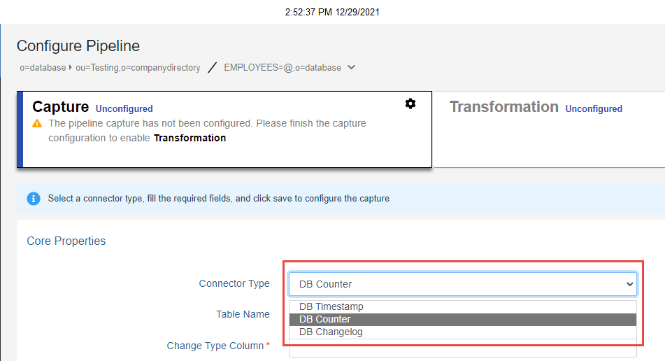

# Chapter 7: Database Counter Connector

To support the Database Counter Connector, the database table must have an indexed column that contains a sequence-based value that is automatically maintained and modified for each record that is added, updated or deleted. The DB Counter connector uses this column to maintain a cursor to keep track of processed changes.

## Supported Database Integer Types

The counter connector supports database integer data types; more specifically, types which can be converted into Java's long data type (approx. from -9.2\*10^18 to 9.2\*10^18).

## Database Connector Failover

The database connector failover functionality is described in [Chapter 5](05-database-changelog-triggers-connector.md#database-connector-failover).

## Configuration

To detect changes using the Database Counter Connector, set the connector type in the pipeline configuration by clicking the **Capture** component. In the Core Properties section, select **DB Counter** from the drop-down list.

Figure 7. 1: DB Counter Connector Type

After the DB Counter connector type has been selected and configured, configure the properties in the Core Properties, Advanced Properties, and [Event Content](02-configuring-connector-types-and-properties.md#event-contents) sections at the bottom. For properties common to all connectors, see [Chapter 2](02-configuring-connector-types-and-properties.md#common-properties-for-all-connectors).

### Change Type Column

In the Core Properties section, enter a column name in the Change Type Column property. This value is the database table column name that contains the information about the type of change (insert, update or delete). If the column doesn't have a value, an update operation is assumed.

### Counter Column

In the Core Properties section, enter a column name in the Counter Column property. This value is the database table column name that contains the value that auto-increments when the row changes.

Figure 7. 2: Core Properties for DB Counter Connector

### SQL Filter

SQL filter is used as part of the request for entries captured by the timestamp connector. Only changes that match the filter are published by the connector.

A SQL filter is either a single expression or several single expressions joined by binary operators and brackets ( ). Possible binary operators
are:

- `AND`

- `OR`

- `NOT`

Some examples of valid SQL Filters are:

- `ID='5'`

- `ID='5' AND NAME='ALLEN'`

- `ID='5' AND NAME='ALLEN' OR CITY='SAN FRANCISCO'`

- `ID='5' AND (NAME='ALLEN' OR CITY='SAN FRANCISCO')`

- `NAME LIKE 'AL%'`

- `NAME LIKE 'ALLE\_'`

If the SQL Filter syntax entered into the property is not correct, an error occurs. The connector waits for the length of time specified in the [Retry Interval on Error](02-configuring-connector-types-and-properties.md#retry-interval-on-error) and then tries to get the changed entries in the database again. After the maximum number of retries (indicated in the [Max Retries on Error](02-configuring-connector-types-and-properties.md#max-retries-on-error) property) is exhausted, if the SQL syntax is still invalid, the connector stops. You must either remove or correct the SQL filter before restarting the connector. It is recommended that you set the connector [Log Level](02-configuring-connector-types-and-properties.md#log-level) to DEBUG and check the connector log for the SQL query ("Executing query:") that is generated to ensure the value entered in the `SQL Filter` property is translated properly. The capture connector log is located at `\<RLI_HOME\>\logs\sync_agents\\\<pipelineId\>\connector.log` on the RadiantOne node where the sync agent is running. Run `\<RLI_HOME\>/bin/monitoring.bat` (`.sh` on Linux) `-d pipeline` to locate your sync process and the value of the `captureHostname` propertyId value indicates the machine where the connector.log is located.

If the connector should process all changed entries, do not enter a SQL filter.

### Force Sequential Counters

This property accepts a value of `true` or `false` and dictates how the connector treats entries it picks up from the LOG table that have non-sequential change IDs. The default is `true` meaning that if the connector detects a non-sequential change ID for an entry in the LOG table, it behaves as if there is an error (non-connection error) and the retry logic based on the Max Retries on Error and Retry Interval on Error properties takes effect. Sometimes rows in the log table are not written in the order of the change ID, and if the connector doesn't wait for the entries to have sequential IDs, some changes could be missed. The connector waits for the length of time specified in the [Retry Interval on Error](02-configuring-connector-types-and-properties.md#retry-interval-on-error) and then tries to get the changed entries in the database again. After the maximum number of retries (indicated in the [Max Retries on Error](02-configuring-connector-types-and-properties.md#max-retries-on-error) property) is exhausted, if it still detects non-sequential change IDs, the connector stops. You can [manually edit the cursor value](01-overview.md#manually-updating-connector-cursor) before restarting the connector to avoid the non-sequential number. Or you can disable the Force Sequential Counters property for the connector.

If the connector should ignore non-sequential change IDs, and process all changes immediately, set the property to `false`.
